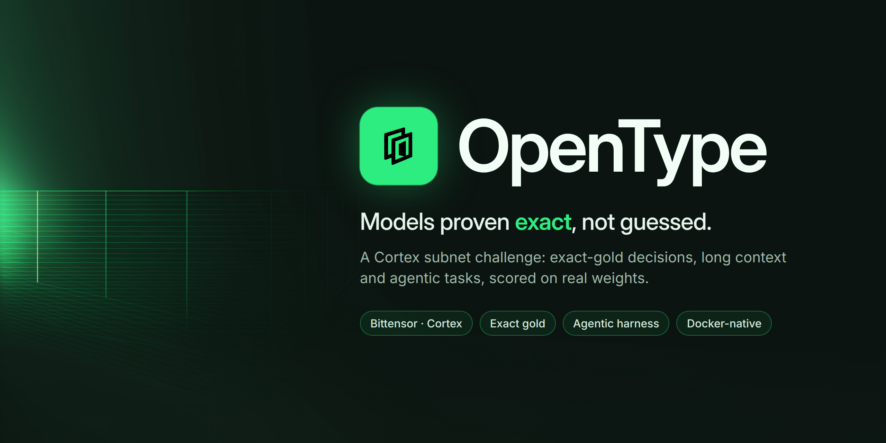

<p align="center"></p>

# OpenType challenge

The `opentype` challenge of the Cortex subnet. Miners fine-tune DiffusionGemma
(`google/diffusiongemma-26B-A4B-it`). The challenge asks whether a checkpoint is more
usable in production than the current champion, and it pays only for statistically
certified gains measured against exact gold.

- **Five tracks, exact gold.** Gold always comes from code: rule interpreters, a written
  store policy, reference SQL, pixel predicates. The only exception is the `depict` level
  of `paint`, which a VLM judge grades against a rubric on the container's own render.
- **A teacher writes content, never labels.** A teacher LLM behind the operator's gateway
  writes private content for each window: sealed record families, prose records, customer
  stories and drawing briefs. A text is admitted only when two extractor models from
  different families recover its exact structured spec.
- **Paired duels on real weights.** One B300 serves the champion and the challenger in
  BF16. Both see the same cases. Each track gives a log loss ratio `g_t`, and the crown
  statistic is their weighted composite.
- **Crowns are certified.** A crown needs the composite LCB99 to reach `-ln 0.95` on both
  halves of the duel, no significant regression on any track, and no regression on the
  mastered (retired) decision levels.
- **A ledger pays certified gain.** Each crown is owed `g_LCB / g_min` epochs of the
  challenge's share. Crowns are paid first in, first out. Anything nobody earns burns.

## Tracks

| Track | Measures | Gold | Loss |
| --- | --- | --- | --- |
| `decisions` | typed decisions over rules, on public and sealed record families, in template or teacher prose | exact Bayes posterior | half-Brier |
| `longctx` | the same reads about one record buried in an 8k–100k-token dossier with corrections and look-alike ids | exact posterior | half-Brier |
| `ops` | a multi-turn customer-operations agent with JSON tools and a written policy | exact write set and outcome | state diff |
| `sql` | a multi-turn analyst over a sandboxed SQLite database | exact reference-SQL answer | 0/1 |
| `paint` | a multi-turn painter that sees its canvas after every turn | `spec`: exact pixel checks; `depict`: VLM rubric | checks failed / judge |

The default duel runs 7,400 cases. Track weights are 0.35 / 0.25 / 0.15 / 0.10 / 0.15.
See [docs/mechanism.md](docs/mechanism.md).

## Anti-cheat highlights

- Each window's teacher content is private while the window is open, published when it
  closes, and never reused. About 30 % of `decisions` cases use sealed families invented
  for that window.
- Case seeds are `HMAC(window secret, job | manifest digest | drand round)`. The window
  secret is committed when the window opens. `opentype-challenge audit` replays every
  served case after the reveal.
- The container never trusts the worker's view of an episode. It replays every harness
  transcript from the raw model outputs, and it renders and judges the paint canvas itself.
- Model output is never executed. The one exception is read-only SQL, run behind an
  sqlite authorizer with a step limit and no clock or randomness.
- The judge is blind to the side and the model. Every rubric includes a no-text item, and
  every rubric must fail on a blank canvas before it is admitted. When a side cannot be
  judged, the whole pair is dropped.

## Miner quickstart

```bash
uv tool install "opentype-challenge[miner,wallet] @ git+https://github.com/OpentypeAI/challenge@v2.0.0"
opentype-challenge generate --level 3 --n 100000 --out decisions.jsonl         # exact soft targets
opentype-challenge generate --track ops --n 20000 --out ops.jsonl              # reference transcripts
# fine-tune, then push safetensors + the base config.json to a public HF repo
opentype-challenge miner submit --api https://<cortex-master>/challenge/opentype \
    --repo you/model --revision <40-hex commit> --wallet-name w --wallet-hotkey h
opentype-challenge miner status --api https://<cortex-master>/challenge/opentype --id s_...
```

See [docs/miner.md](docs/miner.md).

## Operator quickstart

1. Put `internal.token`, `admin.token`, `worker.token` and, optionally, `teacher.token`
   in `<BASE_CHALLENGE_SECRETS_DIR>/opentype/`.
2. Add the `opentype` entry to the Cortex challenge registry with the image
   `ghcr.io/opentypeai/challenge`. To enable the teacher, set `OPENTYPE_TEACHER_URL` and
   allow egress to the gateway and `api.drand.sh`.
3. Run `ghcr.io/opentypeai/challenge-worker` on a B300 with the worker token.

See [docs/operator.md](docs/operator.md).

## Development

```bash
uv sync --all-extras --group dev
uv run ruff format --check && uv run ruff check && uv run mypy && uv run pytest
docker build --target server -t opentype-challenge:local .
```

## Documentation

- [Architecture](docs/architecture.md): modules, the life of a submission, failure classes
- [Mechanism](docs/mechanism.md): tracks, gold, teacher, judge, scoring, ladder, ledger,
  anti-cheat and residual risks
- [Build contract](docs/tracks.md): exact v2 names, shapes and formulas
- [Miner guide](docs/miner.md)
- [Operator guide](docs/operator.md)
- [API reference](docs/api.md)
- [Changelog](CHANGELOG.md)

Licensed under Apache-2.0.
